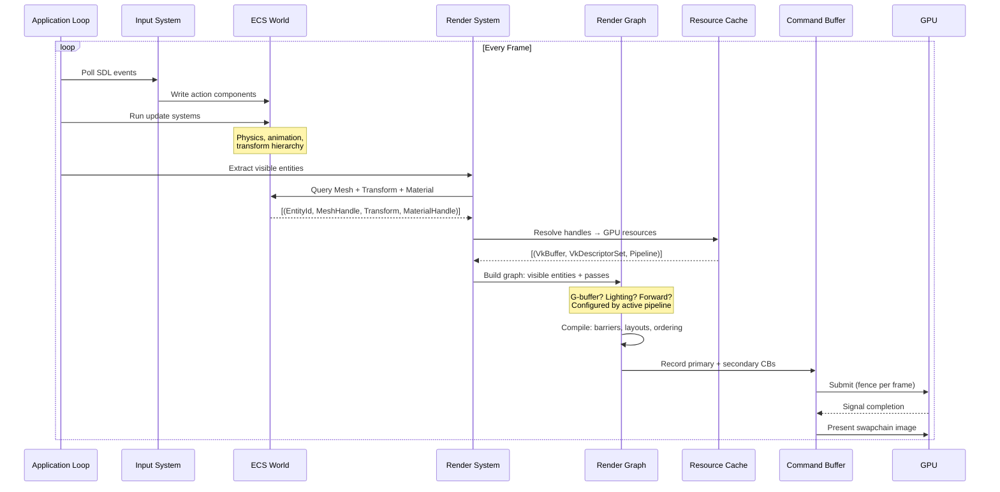
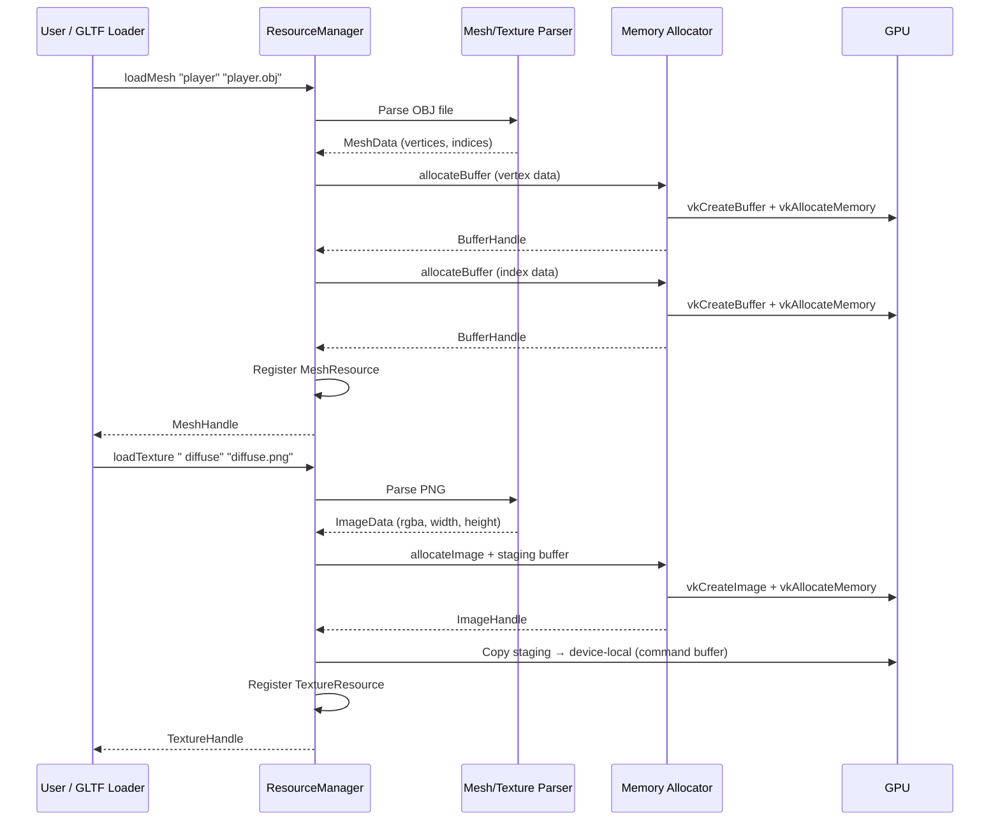
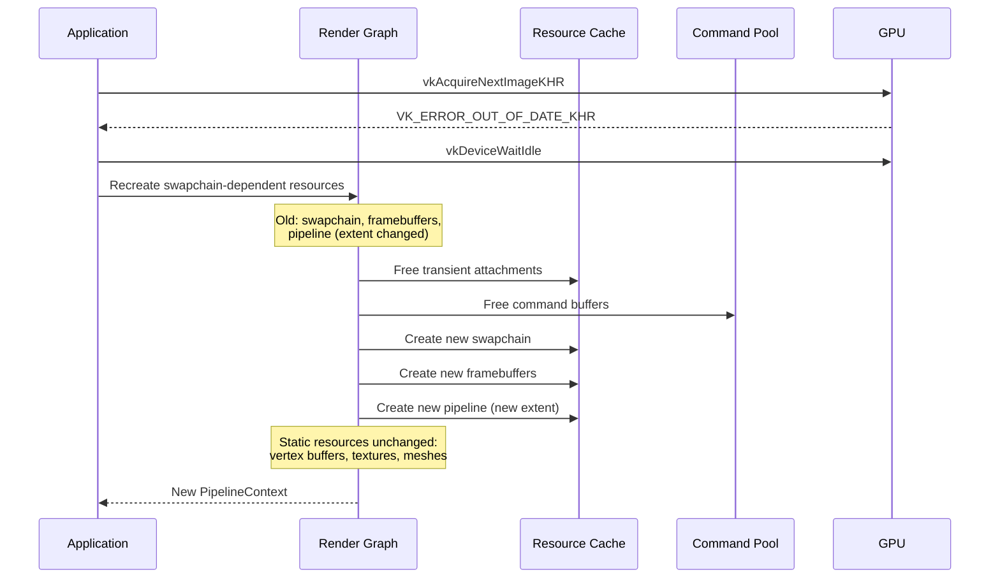
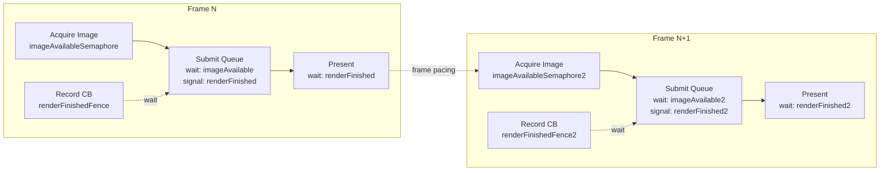

# Data Flow Diagram

## Frame Lifecycle



## Resource Loading Flow



## Resize / Swapchain Recreate Flow



## Memory Flow

```mermaid
graph LR
    subgraph "CPU Memory"
        OBJ[OBJ/GLTF File]
        PNG[PNG Texture]
        MeshData[Parsed MeshData]
        ImageData[Parsed ImageData]
    end

    subgraph "Staging Memory"
        StagingBuf[Staging Buffer<br/>HOST_VISIBLE | HOST_COHERENT]
    end

    subgraph "GPU Memory"
        VertexBuf[Vertex Buffer<br/>DEVICE_LOCAL]
        IndexBuf[Index Buffer<br/>DEVICE_LOCAL]
        Texture[Texture Image<br/>DEVICE_LOCAL]
        UniformBuf[Uniform Buffer<br/>HOST_VISIBLE]
    end

    OBJ --> MeshData
    PNG --> ImageData

    MeshData --> StagingBuf
    ImageData --> StagingBuf

    StagingBuf --> VertexBuf
    StagingBuf --> IndexBuf
    StagingBuf --> Texture

    CPU[CPU Update] --> UniformBuf
```

**Key principle:** CPU data → staging buffer → GPU device-local memory. Only uniform buffers stay host-visible for per-frame updates.

## Synchronization Flow



**Per-frame resources (double/triple buffered):**
- `imageAvailableSemaphore[frameIndex]`
- `renderFinishedSemaphore[frameIndex]`
- `renderFinishedFence[frameIndex]`
- `commandBuffer[frameIndex]`
- `uniformBuffer[frameIndex]` (for per-frame data)

**Static resources (shared across frames):**
- Vertex/index buffers
- Textures
- Descriptor set layout
- Pipeline layout

## Component Data Flow (ECS)

```mermaid
graph TB
    subgraph "World State"
        Entities[EntityId: 0, 1, 2, ...]
        Transforms[Transform Component<br/>position, rotation, scale]
        Meshes[Mesh Component<br/>MeshHandle reference]
        Materials[Material Component<br/>MaterialHandle reference]
        Visibility[Visibility Component<br/>bool, frustum cull result]
    end

    subgraph "Systems"
        InputSys[Input System<br/>writes: Transform]
        PhysicsSys[Physics System<br/>reads/writes: Transform]
        CullSys[Frustum Cull System<br/>reads: Transform, Mesh<br/>writes: Visibility]
        RenderSys[Render System<br/>reads: Transform, Mesh, Material, Visibility]
    end

    subgraph "Output"
        DrawList[Draw List<br/>[(Mesh, Transform, Material)]]
    end

    InputSys --> Transforms
    PhysicsSys --> Transforms
    Transforms --> CullSys
    Meshes --> CullSys
    CullSys --> Visibility

    Transforms --> RenderSys
    Meshes --> RenderSys
    Materials --> RenderSys
    Visibility --> RenderSys
    RenderSys --> DrawList
```

Systems run in phases:
1. **Update phase** — Input, physics, animation (parallel where possible)
2. **Cull phase** — Frustum culling, occlusion culling
3. **Render phase** — Extract visible entities, build draw list, submit to render graph
