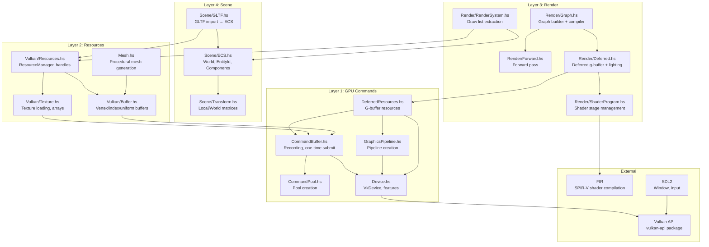

# Subsystem Diagram

## Module Dependencies



## Responsibility Matrix

| Module | Layer | Responsibility | Depends On |
|--------|-------|---------------|------------|
| `Scene/ECS.hs` | 4 | Entity storage (`IntMap` sparse sets), component arrays, spawn/set/get | — |
| `Scene/Transform.hs` | 4 | Local/world matrix computation, `toMatrix`, default transform | linear |
| `Scene/GLTF.hs` | 4 | Parse GLTF → ECS entities + ResourceManager handles, node hierarchy | ECS, Resources, Texture |
| `Render/Graph.hs` | 3 | Build render pass DAG, compile (topo sort), `CompiledPass` list | — |
| `Render/Forward.hs` | 3 | Forward rendering pass definition | Graph |
| `Render/Deferred.hs` | 3 | Deferred g-buffer + lighting graph builder | Graph, DeferredResources |
| `Render/RenderSystem.hs` | 3 | Extract visible entities, build `DrawCall` list, resolve handles | ECS, Resources |
| `Render/ShaderProgram.hs` | 3 | Shader stage management, variable stage count, `toPipelineStages` | FIR |
| `Vulkan/Resources.hs` | 2 | Handle allocation, STM registry (`HashMap`), lookup | STM |
| `Vulkan/Texture.hs` | 2 | Texture loading, `Texture2DArray` creation, asset cache integration | Resources, Buffer, CommandBuffer |
| `Vulkan/Buffer.hs` | 2 | Vertex/index/uniform buffer creation, `updateUniformBufferRegion` | Memory, CommandBuffer |
| `Vulkan/CommandBuffer.hs` | 1 | Command buffer recording, one-time submit, copy helpers | CommandPool |
| `Vulkan/CommandPool.hs` | 1 | Pool creation with `RESET_COMMAND_BUFFER_BIT` | Device |
| `Vulkan/Device.hs` | 1 | Logical device creation, feature enablement (geometry, descriptor indexing), pNext chaining | PhysicalDevice |
| `Vulkan/GraphicsPipeline.hs` | 1 | Pipeline creation, `ShaderProgram` → `VkPipelineShaderStageCreateInfo` array | Device, ShaderProgram |
| `Vulkan/DeferredResources.hs` | 1 | G-buffer images, framebuffers, lighting pass resources, wireframe pipeline | Device, GraphicsPipeline, CommandBuffer |

## Data Ownership

**Who creates what:**
- `Device` → created once at startup, lives for app lifetime
- `CommandPool` → one per thread, created at startup
- `ResourceManager` → created after device, manages all GPU resources
- `RenderGraph` → built per-frame or per-resize from scene + materials
- `World` (ECS) → mutable state, systems read/write components

**Lifetime relationships:**
```
App lifetime: Instance → Device → CommandPool → ResourceManager
Frame lifetime: RenderGraph → CommandBuffers → Submit → Present
Scene lifetime: World → Entities → Components → MeshHandles/TextureHandles
```

## Inversion of Control

The engine uses **push-based** rendering:

1. **Input** pushes events to `actionQueue` (read by `stateUpdateLoop`)
2. **State update loop** reads `World` state, updates camera and movement flags
3. **Render thread** (`renderFrameLoop`) extracts draw list via `extractDrawList`, reads camera from `TVar`
4. **Render graph** builds g-buffer + lighting passes, compiles, executes
5. **Command buffer recording** happens per-frame inside `renderImage`
6. **GPU** executes asynchronously, signals fence on completion

Threads:
- **Main thread:** SDL event polling (`inputLoop`)
- **State thread:** `stateUpdateLoop` — camera updates, movement physics
- **Render thread:** `renderFrameLoop` — draw list extraction, graph build/compile/execute, present
