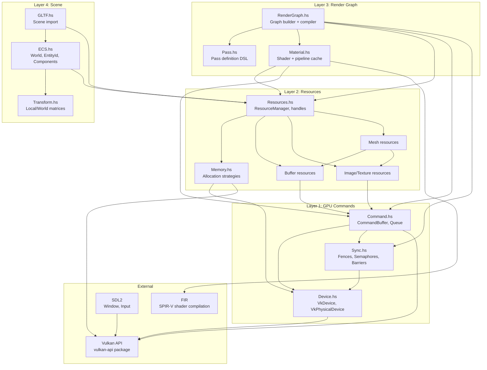

# Subsystem Diagram

## Module Dependencies



## Responsibility Matrix

| Module | Layer | Responsibility | Depends On |
|--------|-------|---------------|------------|
| `ECS.hs` | 4 | Entity storage, component arrays, system scheduling | Resources, Transform |
| `Transform.hs` | 4 | Local/world matrix computation, scene graph hierarchy | ECS |
| `GLTF.hs` | 4 | Parse GLTF → ECS entities + ResourceManager handles | ECS, Resources |
| `RenderGraph.hs` | 3 | Build render pass DAG, compile to command buffers, insert barriers | Pass, Material, Resources, Command |
| `Pass.hs` | 3 | Pass definition DSL, input/output attachment specification | — |
| `Material.hs` | 3 | Shader program linking, pipeline state caching, descriptor set layout | Resources, Command |
| `Resources.hs` | 2 | Handle allocation, reference counting, registry lookup | Memory, Command |
| `Memory.hs` | 2 | `vkAllocateMemory` / VMA abstraction, sub-allocation | Device |
| `Command.hs` | 1 | Command buffer recording (primary/secondary), queue submission | Device, Sync |
| `Sync.hs` | 1 | Fence/semaphore management, pipeline barrier generation | Device |
| `Device.hs` | 1 | Logical device creation, queue family selection, physical device query | Vulkan |

## Data Ownership

**Who creates what:**
- `Device` → created once at startup, lives for app lifetime
- `CommandPool` → one per thread, created at startup
- `ResourceManager` → created after device, manages all GPU resources
- `RenderGraph` → built per-frame or per-resize from scene + materials
- `World` (ECS) → mutable state, systems read/write components

**Lifetime relationships:**
```
App lifetime: Instance → Device → CommandPool → ResourceManager
Frame lifetime: RenderGraph → CommandBuffers → Submit → Present
Scene lifetime: World → Entities → Components → MeshHandles/TextureHandles
```

## Inversion of Control

The engine uses **push-based** rendering:

1. **Input** pushes events to `World` (ECS)
2. **Systems** read `World` state, update components
3. **Render system** extracts visible entities, builds `RenderGraph`
4. **Graph compiler** generates command buffers, submits to GPU
5. **GPU** executes asynchronously, signals fence on completion

This is inverted from the current code where `Engine.hs` pulls everything together in one monolithic function.
